# Lab 4 - Data Analytics

## Introduction

One of the first things your data analysts and data engineers will need
to do is analyse the raw data, with a view to preparing and transforming
it to a state that will be consumable by AI/ML model algorithms.

In this lab, we're going to use a powerful toolset combining

-   An in-memory data analytics engine called Trino. Trino provides high speed access to many different on-premises and cloud based data sources. These include relational and no-SQL databases, object stores over S3 interfaces, Streaming data from Kafka and many more. Trino abstracts the actual underlying data store implementation and provides a uniform ANSI SQL interface, to access its many supported data stores.

-   A visualization tool called Superset, which will use Trino as the backing data source.

The combination of these two tools will provide powerful data analytics
capabilities, critical at this stage in the workflow.

This diagram illustrates what we're implementing:

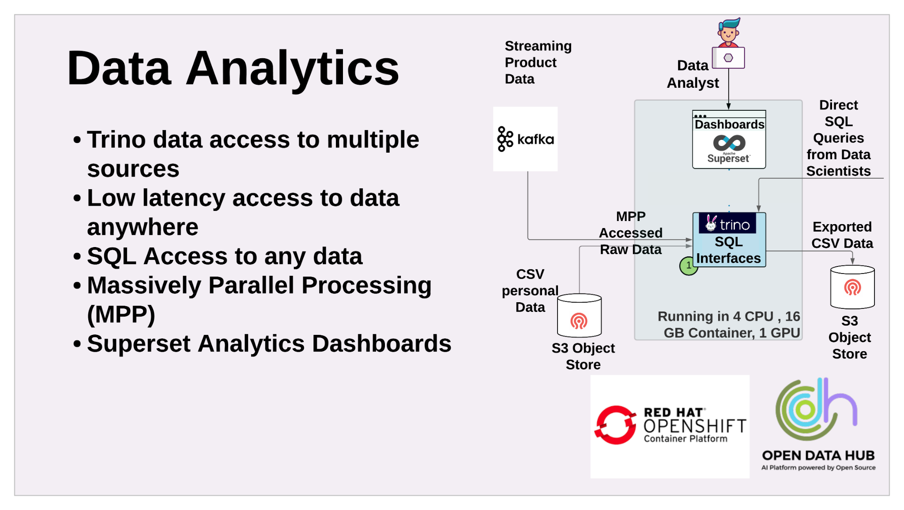{width="5.234375546806649in"
height="2.9534230096237972in"}

You can see Trino is an SQL exposing abstraction in front of actual data
located in Kafka and S3 Object storage. No data is moved - rather Trino
provides a high speed parallel access mechanism for Kafka and S3
allowing Superset to easily display charts and dashboards.

To save time, the workshop administrators have already wired up the SQL
exposing engine Trino to two backing datasets:

1.  To a CSV file over an S3 interface. This CSV file is located in an underlying Object storage implementation called Minio. The file contains demographic type data on our customer data set, data such as gender, whether they have dependents and other demographic features.

2.  To Streaming data located in an Apache Kafka store on the OpenShift cluster. This dataset contains product consumption for the same customers as are in the CSV file. Each record is labelled indicating whether that customer churned or not.

In Superset, using Trino, we\'ve created two logical SQL tables
corresponding to underlying data sets as well as a query joining them on
customer id.

## Instructions for the Trino backed Superset workshop

Login to OpenShift using the credentials your administrator gave you.
Ensure your workshop project ml-workshop is selected.

The first thing you will do is login to Superset.\
Choose the **Administration perspective**

1.  Navigate to **Networking \> Routes**.

2.  Filter on the word Superset and open that route, by clicking on the URL as shown.

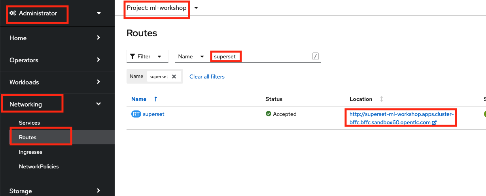{width="6.0in"
height="2.4305555555555554in"}

3.  Enter credentials ***admin / admin***.

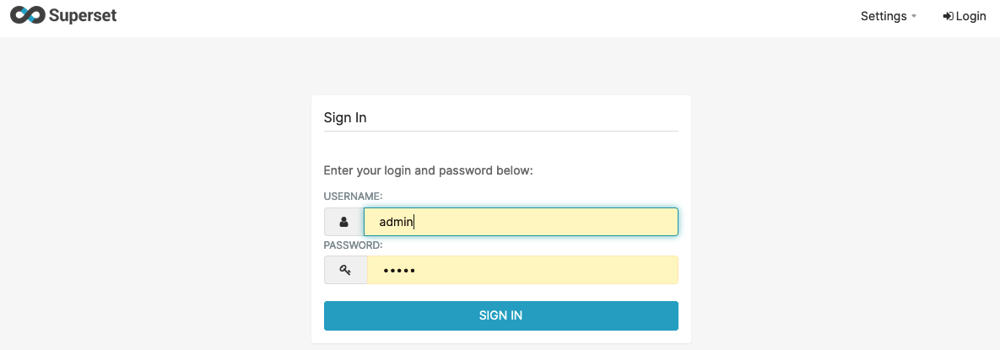{width="6.0in"
height="2.0972222222222223in"}

4.  Choose menu **Data \> Databases**. Edit the ***trino*** Database. As this is a shared service between all participants, and the setup has already been done by your instructor, we'll just show you the steps we took to connect Superset to Trino & from there to underlying data.

{width="6.0in"
height="1.7638888888888888in"}

> Notice we simply added the URI ***trino://admin@trino-service:8080/***
> to connect to Trino as shown. 

Test the Connection.

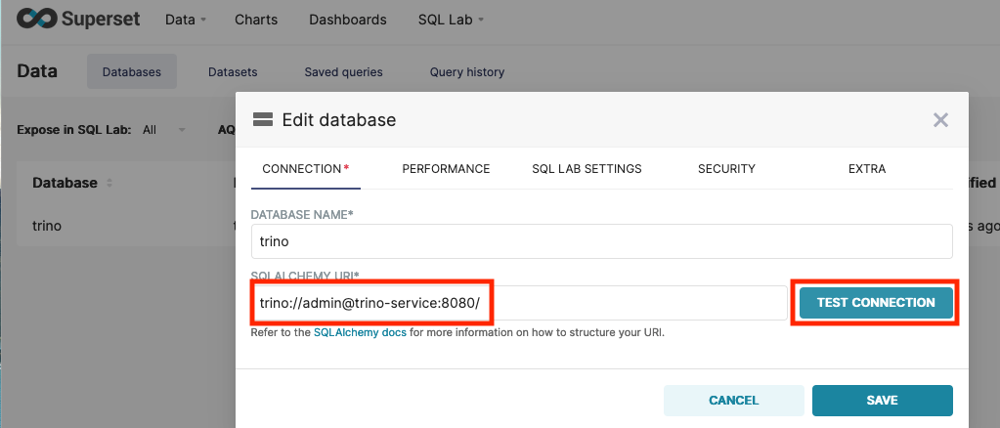{width="4.421875546806649in"
height="1.8920527121609798in"}

5.  Move to the SQL LAB SETTINGS tab and notice we needed full access by selecting the checkboxes.

{width="6.0in"
height="3.0277777777777777in"}

6.  In Superset, choose **SQL LAB \> Saved Queries**. Edit the query ***Kafka-CSV-Join*** as shown (though your query may be named differently)

{width="6.817708880139983in"
height="1.8275601487314086in"}

Earlier the workshop admin created a virtual '***table'*** (hive.default.customer1) that uses the CSV data in our Minio S3 Object store as it's actual data - located in the bucket ***rawdata***.

Earlier we also created a second virtual '***table'*** backed by our Kafka streaming data. In our case this is the customer product consumption data.\

Now Trino allows us to create a SQL Join across data that resides in S3 Object storage and Kafka as follows:
```sql
SELECT  kafkaData.*, s3Data.*
FROM    customerchurn.default.data kafkaData,
        hive.default.customer1 s3Data
WHERE   cast(kafkaData.customerId as VARCHAR) = s3Data.customerId
```
Very cool!

7.  **Run** the Query. Notice the result set spanning data covering S3 and Kafka, joined on *customerId.* Click **Explore**

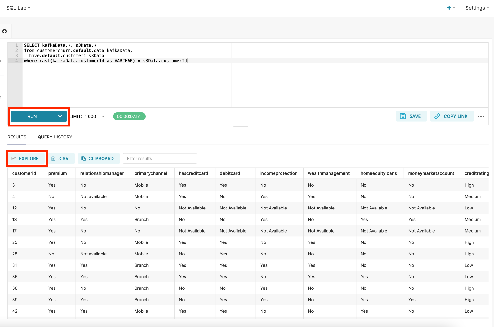{width="5.684896106736658in"
height="3.769574584426947in"}

8.  Select **Save As New** Give it a name appending your username to ***Kafka-CSV-Join***. In my case, with user29: ***Kafka-CSV-Join-user29***. Then **Save & Explore**:

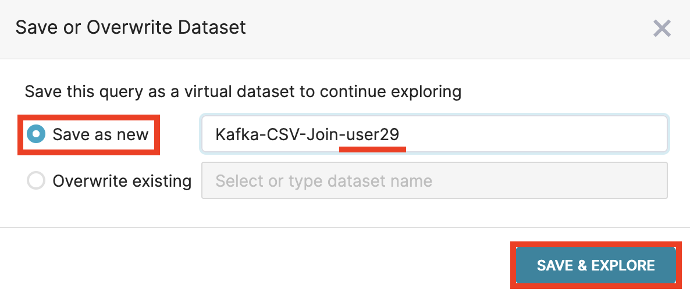{width="5.558170384951881in"
height="2.406742125984252in"}

> You may see an error saving the dataset. Ignore it (this is a small
> bug) - it probably saved successfully.

9.  Move to **Data \> DataSets**, find [your]{.underline} new dataset - then click it to open it:

{width="6.0in"
height="1.8333333333333333in"}

10. By default ***Table*** Visualisation Type is selected

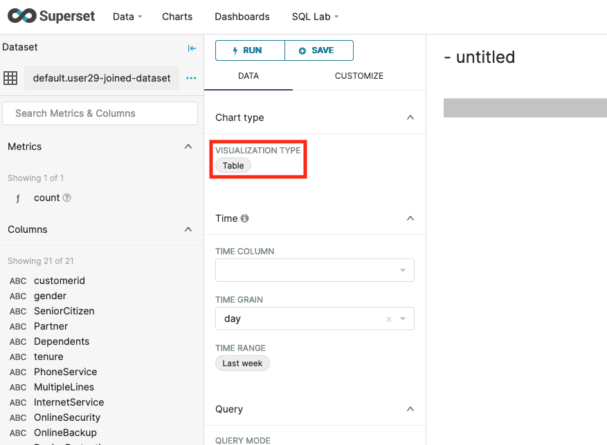{width="6.0in"
height="4.402777777777778in"}

Click **Table**. You have a large number of Visualization Types to choose from. Click **Bar Chart**:

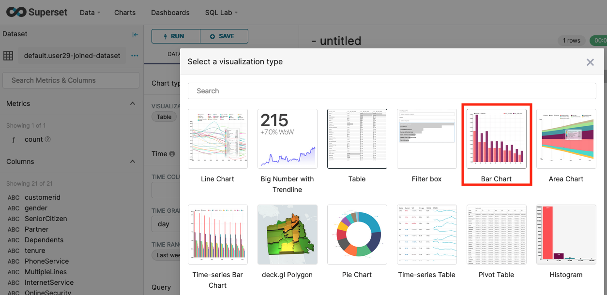{width="5.171875546806649in"
height="2.5230850831146108in"}

You can now start visualising and understanding your data. First we\'ll create a bar chart representation of the entire dataset, representing the count of the different categories of *Primary Channel*:

- *Branch*

- *Mobile and*

- *No* primary channel.

Click **Last Week** under **TIME RANGE**. On the popup, click the **Range Type** dropdown, select **No Filter** and then **Apply**.

{width="3.9114588801399823in"
height="3.239048556430446in"}

Select ***Count*** under ***Metrics*** and select *PrimaryChannel* under ***Series***.

Name the chart ***Count-PrimaryChannel-userXX*** (in my case***Count-PrimaryChannel-user29***) and click **Save**.

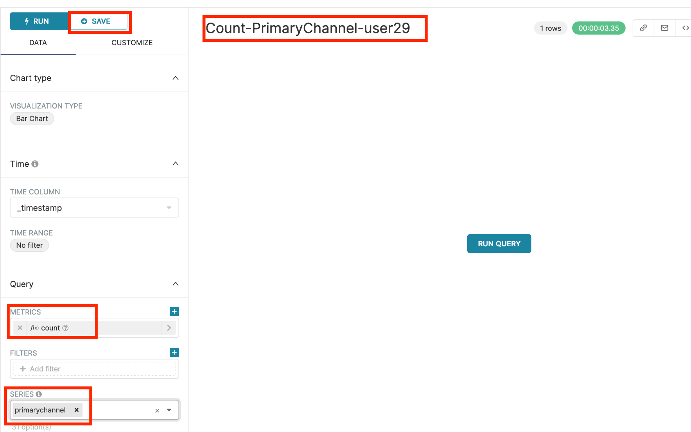{width="4.734375546806649in"
height="2.9589840332458444in"}

This will cause the query to run - and you will be presented with this bar chart - showing the breakdown of the resultset by Primary Channel, Branch, Mobile or None.

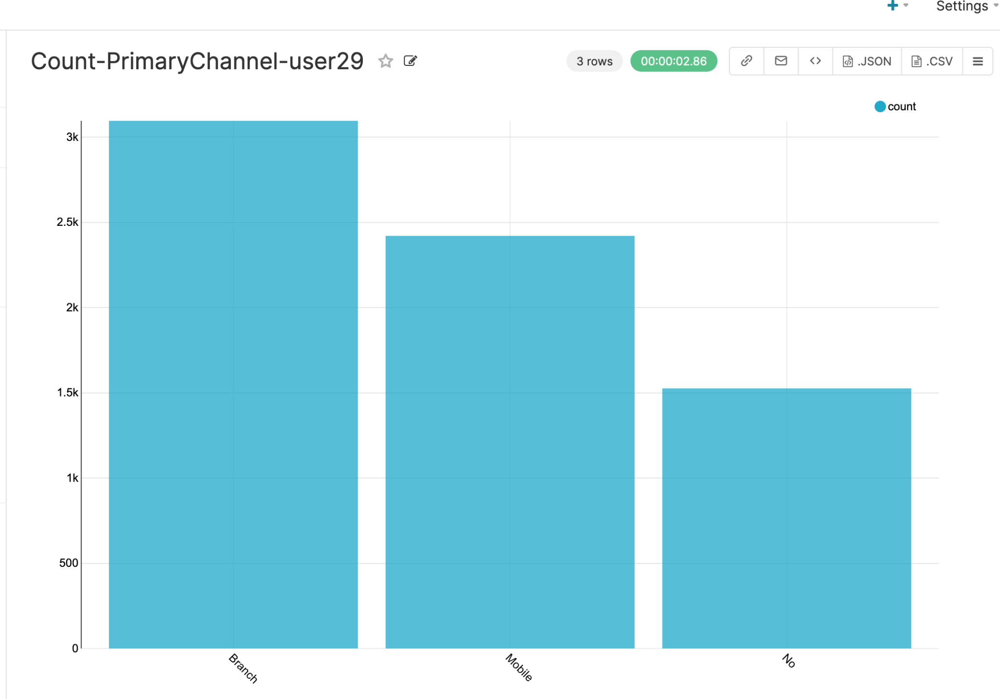{width="6.0in"
height="4.194444444444445in"}

11. Now we\'ll create a Pie Chart - and add another dimension - *account type*.

On your open Bar Chart screen, click **Bar Chart**. On the popup click **Pie Chart**.

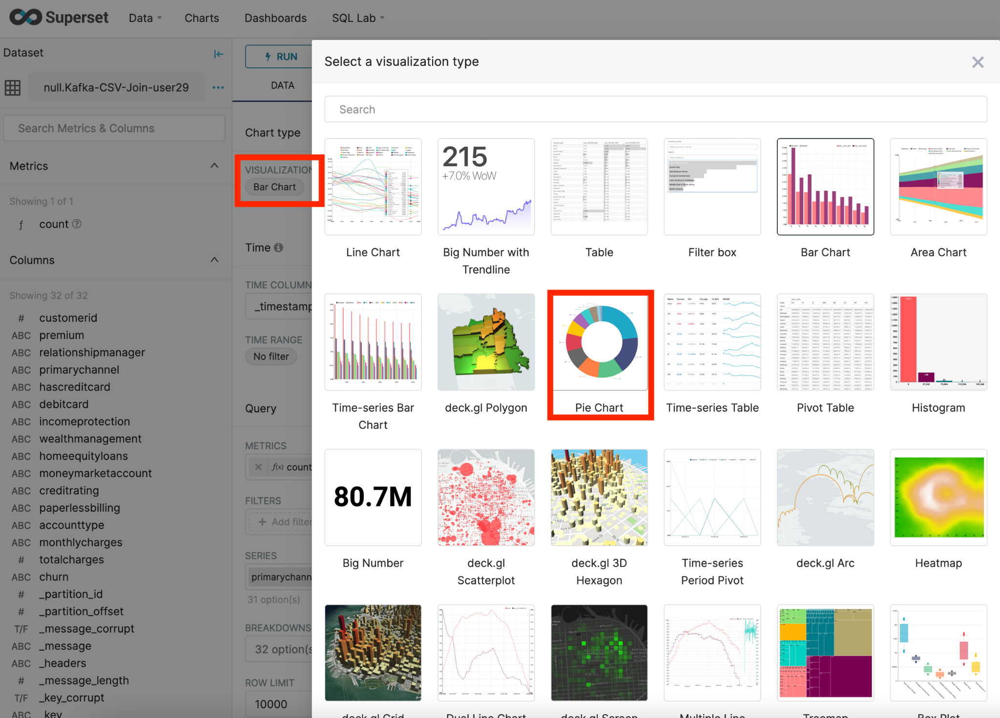{width="6.0in"
height="4.319444444444445in"}

Now make the following changes:

-   On the **Group By** dropdown, add ***accounttype*** to already present **primarychannel**

-   Name the chart ***Count-ChannelByAccountType-userXX*** (in my case ***Count-ChannelByAccountType-user29***) and click **Save**.

-   Go with the defaults on the popup. Click **Save As** then **Save**

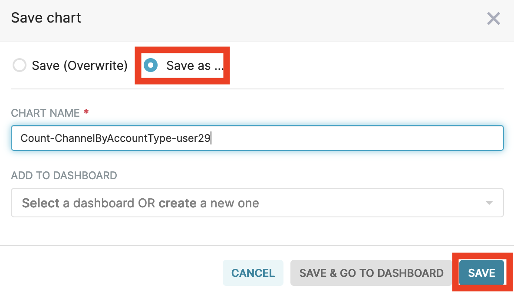{width="2.921593394575678in" height="1.6742979002624672in"}

This will cause the following pie chart to display - grouping *Primary Channel* by *Account Type*

{width="6.0in"
height="4.208333333333333in"}

12. Next, we're going to showcase another unusual though informative visualization - the Sunburst Chart. It allows you to visualise splits of your data with varying degrees of granularity - within the same chart. On your open Pie Chart screen, click **Pie Chart** then on the popup, scroll down and click **Sunburst Chart** as shown:

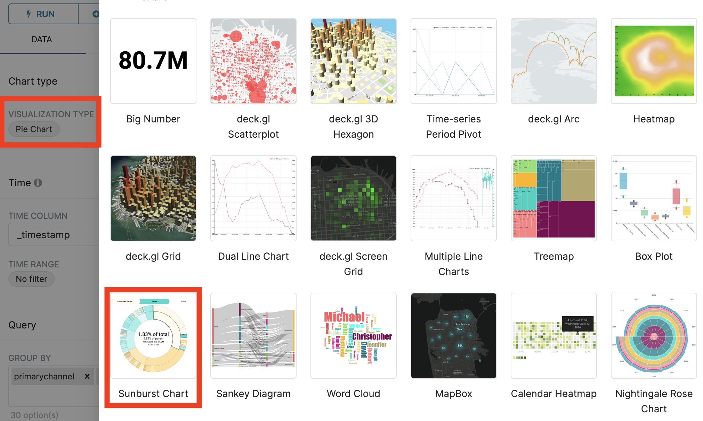{width="6.0in"
height="3.5972222222222223in"}

Make the following changes

-   Name the chart ***CreditRating-Distribution-userXX*** (in my case ***CreditRating-Distribution-user29***)

-   On the **Hierarchy** dropdown, select

    -   **creditrating**

    -   **accounttype**

    -   **hascreditcard**

        -   **debitcard**

-   click **Save**

as shown:

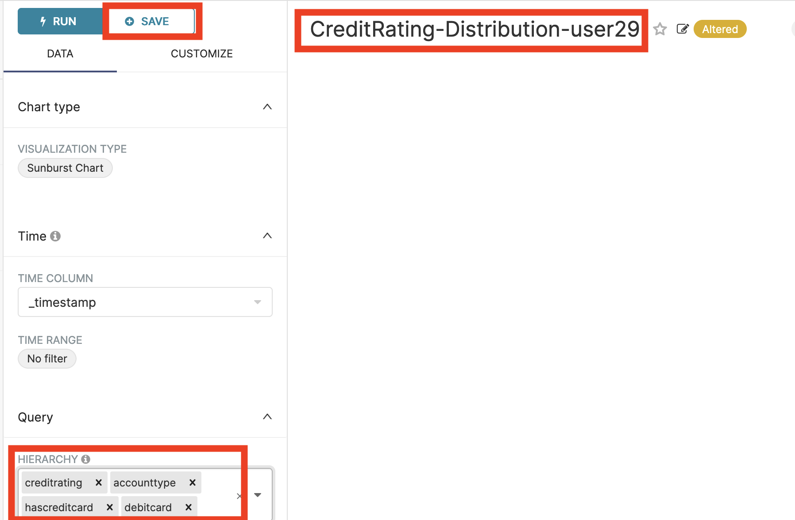{width="6.0in"
height="3.9305555555555554in"}

Confirm by clicking **Save As** then **Save**

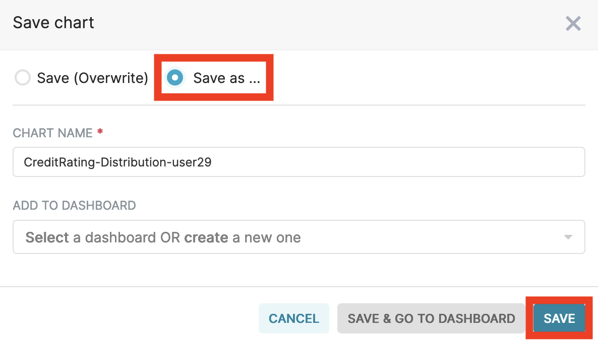{width="6.0in"
height="3.4583333333333335in"}

A chart similar to the following will appear.

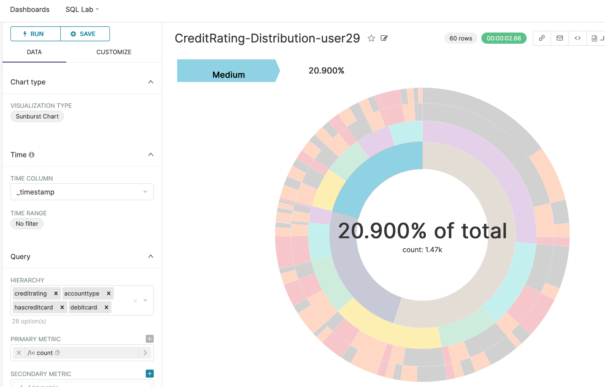{width="6.0in"
height="3.8472222222222223in"}

If you hover over the inner circle, the breakdown according to the first hierarchical element is shown, in my case *medium* credit rating.

You can see, you can also further refine, by hovering out towards over the outer circle - giving a very fine grained breakdown - according to the 4 hierarchies:

{width="4.213542213473316in"
height="2.392062554680665in"}

Any of these datasets can be easily exported to JSON or CSV - as shown below. Then fed for example to an AI model training use case.

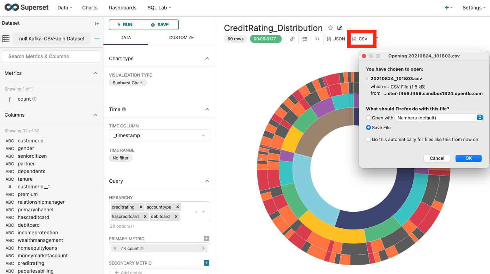{width="6.0in"
height="3.361111111111111in"}

13. Finally we're going to show you how to create a dashboard - to which we can add previously saved charts. Choose Dashboards -\> Add Dashboard as shown:

{width="6.0in"
height="0.9027777777777778in"}

Name it and choose the Charts tab:

{width="6.0in"
height="1.2361111111111112in"}

You can simply drag your charts from the right over to the display panel
on the left as shown. You can also make them dynamic by choosing a
refresh interval. Very cool!

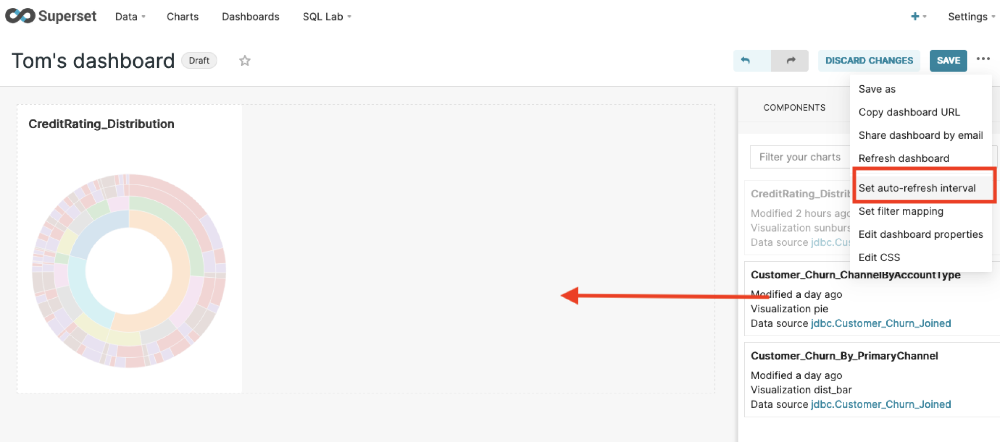{width="6.0in"
height="2.6527777777777777in"}

Feel free to continue to experiment with different ways of accessing and
visualising the underlying data.
